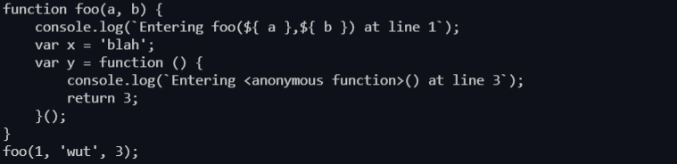

# Procesadores de lenguajes 2022-2023 <!-- omit in toc -->

#### Sergio de la Barrera García - alu0100953275 <!-- omit in toc -->

- [Resumen de lo aprendido](#resumen-de-lo-aprendido)
- [El ejecutable](#el-ejecutable)
- [CLI con Commander.js](#cli-con-commanderjs)
- [Reto 1: Soportar funciones flecha](#reto-1-soportar-funciones-flecha)
- [Reto 2: Añadir el número de línea](#reto-2-añadir-el-número-de-línea)
- [Tests](#tests)
- [Coverage](#coverage)
- [Integración continua](#integración-continua)
- [Publicación como paquete npm](#publicación-como-paquete-npm)
- [Uso de dicho paquete](#uso-de-dicho-paquete)
- [Documentación](#documentación)


## Resumen de lo aprendido

A continuación vamos a explicar la ejecución del programa.

Una vez ejecutado por línea de comandos el programa con el *input* y el *output* file entraríamos en la función `transpile()` la cual con esos files lee el input, que en este caso sería el código siguiente:

```js
// test1
function foo(a, b) {   
    var x = 'blah';   
    var y = (function () {
      return 3;
    })();
  }     
foo(1, 'wut', 3);
```

Este código se pasa a la función addLogging la cual convierte dicho código en un AST haciendo transformaciones tales como las siguientes:

- Primero que mada crea un nodo de typo *Program*, dicho nodo tiene un cuerpo llamado *body* con 2 nodos, uno para la declaración de la función *FunctionDeclaration* ,que en este caso sería la declaración de foo, y otro para la expresión de una funcion *ExpressionStatement*, que en este ejemplo es para el uso de foo:


- Si seguimos avanzado hacia dentro de *FunctionDeclaration* este contiene otro nodo de tipo *BlockStatement* que coincide con las llaves de declaración de la función.
  
- Como podemos imaginar dentro de *BlockStatement* existen otros dos nodos correspondientes a las declaraciones de las variables x e y *VariableDeclaration* y a su vez este contiene un id *Identifier.name* que coincide con el nombre de la variable 'x':
  


- Además contiene un *Init* de tipo *Literal* que coincide con 'blah':
  

> Nótese que al tratarse de un string (literal) en el recuadro azul el raw sale con dos comillas dobles, en cambio si fuera de otro tipo aparecería con comillas simples

Centrándonos un poco en la ejecución, a continuación se le pasa el AST creado anteriormente a la función `estraverse.traverse()` y escogiendo entre los dos tipos enter o leave:

Si usas *enter*: actua al entrar en un nodo del árbol AST. En cambio si usas *leave* actuaría una vez está haciendo el backtracking, es decir, una vez llegado al final de los nodos al volver es cuando actuaría.

- En nuestro caso usamos *enter* para cada vez que entre en un nodo y dicho nodo sea del tipo *FunctionDeclaration* o *FunctionExpresion* o *ArrowFunctionExpression*, añadido este último en el reto 1, llame a la función `addBeforeCode()`:

```js
export async function transpile(inputFile, outputFile) {
  let input = await fs.readFile(inputFile, 'utf-8', (err) => {
    if (err) {
      console.log(err);
    }
  });
  const afterAdd = addLogging(input);

  await fs.writeFile(outputFile, afterAdd, (err) => {
    if (err)
      console.log(err);
    else {
      console.log("File written successfully\n");
    }
  });
}
```

- En esta función `addBeforeCode()` lo que se hace es coger el nombre de la función a la que se entra, sus variables y la línea del código en la que se usa dicha función:

  - Código:
    ```js
      function addBeforeCode(node) {
        const name = node.id ? node.id.name : '<anonymous function>';
        let arrayNames = []
        for (let iterator in node.params) {
          arrayNames.push('${ ' + (node.params[iterator].name) + " }")
        }
        var beforeCode = "console.log(`Entering " + name + "(" + arrayNames.toString() +  ") at line " + node.loc.start.line + "`);";
        var beforeNodes = espree.parse(beforeCode, {ecmaVersion:6}).body;
        node.body.body = beforeNodes.concat(node.body.body);
      }
    ```

  - Resulado esperado:

    

- Por último, una vez reestructurado el código con los nuevos *console.log()* devolvemos el AST transfromado. Por tanto volvemos a la función transpile y allí lo escribimos en el fichero de salida:
  - Código:

    ```js
      export async function transpile(inputFile, outputFile) {
        let input = await fs.readFile(inputFile, 'utf-8', (err) => {
          if (err) {
            console.log(err);
          }
        });
        const afterAdd = addLogging(input);

        await fs.writeFile(outputFile, afterAdd, (err) => {
          if (err)
            console.log(err);
          else {
            console.log("File written successfully\n");
          }
        });
      }
    ```

  - Resultado en fichero:

    
## El ejecutable

El ejecutable está en `bin/logging.js`

``` bash
$ bin/log.js -h
Usage: logging-espree [options] <filename> [...]

Adds logs to js code

Arguments:
  filename                 file with the original code

Options:
  -V, --version            output the version number
  -o, --output <filename>  file in which to write the output (default: "salida.js")
  -h, --help               display help for command
```

```bash
git:(main) $ cat test/test1.js 
function foo(a, b) {   
    var x = 'blah';   
    var y = (function () {
      return 3;
    })();
  }     
foo(1, 'wut', 3);
(master) $ bin/log.js test/test1.js -o salida.js
File read succesfully
Output written succesfully in salida.js
(master) $ node salida.js
Entering foo(1, wut) at line 1
Entering <anonymous function>() at line 3
```

Sin embargo también se puede ejecutar llamando a `funlog`:

```bash
 $ npx funlog -h
Usage: logging-espree [options] <filename> [...]

Adds logs to js code

Arguments:
  filename                 file with the original code

Options:
  -V, --version            output the version number
  -o, --output <filename>  file in which to write the output (default: "salida.js")
  -h, --help               display help for command
```

## CLI con [Commander.js](https://www.npmjs.com/package/commander)

Para utilizar nuestro programa haciendo uso de la línea de comandos utilizamos el módulo npm *log.js*. Por ello usamos el siguiente código:

```js
#!/usr/bin/env node

import { program } from "commander";
import { createRequire } from "module";
const require = createRequire(import.meta.url);
const { version, description } = require("../package.json");
import { transpile } from "../src/logging-espree.js";

program
  .name("logging-espree")
  .version(version)
  .description(description)
  .usage('[options] <filename> [...]')
  .argument("[filename]", 'file with the original code')
  .option("-o, --output <filename>", "file in which to write the output", "salida.js")
  .action((filename, options) => {
    if (filename) {
      transpile(filename, options.output);
    } else {
      program.help();
    }
  });

program.parse(process.argv);

```

## Reto 1: Soportar funciones flecha

Para poder hacer esto, es necesario saber de qué tipo son llamadas las funciones flechas en un árbol AST. Por esto vamos a debuguear nuestro programa y cuando se llama a la función flecha, saber que tipo se le asigna:


Como podemos ver dentro del body del *BlockStatement* encontramos 4 nodos, 3 de ellos de tipo *VariableDeclaration* y cogemos el nodo 3. Allí podemos ver que el type es *ArrowFunctionExpression*.
Una vez sabemos esto simplemente tenemos que añadirlo a la condición de la función principal *addLogging* quedando de la siguiente forma:

```js
export function addLogging(code) {
  const ast = espree.parse(code, {ecmaVersion:6, loc:true});
  estraverse.traverse(ast, {
      enter: function(node, parent) {
          if (node.type === 'FunctionDeclaration' ||
              node.type === 'FunctionExpression' || 
              node.type === 'ArrowFunctionExpression') {
              addBeforeCode(node);
          }
      }
  });

  return escodegen.generate(ast);
}
```

## Reto 2: Añadir el número de línea

Para que nos salgan el número de línea en el log de la función es necesario añadir `loc:true` en el *espree.parse()*, quedando de la siguiente manera:

```js
export function addLogging(code) {
  const ast = espree.parse(code, {ecmaVersion:6, loc:true});
  estraverse.traverse(ast, {
      enter: function(node, parent) {
          if (node.type === 'FunctionDeclaration' ||
              node.type === 'FunctionExpression' || 
              node.type === 'ArrowFunctionExpression') {
              addBeforeCode(node);
          }
      }
  });

  return escodegen.generate(ast);
}
```
> De esta forma aparecen las líneas tanto inicial como final

Una vez hecho esto, debugueamos el programa para encontrar al igual que con las funciones flechas, cómo acceder a ellas:


> como vemos en la foto para acceder a ellas es necesario acceder a `node.loc.start.line`

A continuación añadimos esa forma de acceder en el log de nuestro programa:

```js
function addBeforeCode(node) {
  var name = node.id ? node.id.name : '<anonymous function>';
  let arrayNames = []
  for (iterator in node.params) {
    arrayNames.push('${ ' + (node.params[iterator].name) + " }")
  }
  var beforeCode = "console.log('Entering " + name + "(" + arrayNames.toString() +  ") at line " + node.loc.start.line + "');";
  var beforeNodes = espree.parse(beforeCode).body;
  node.body.body = beforeNodes.concat(node.body.body);
}
```

## Tests

A continuación vamos a comprobar los test añadiendo el script *test* del ` package.json` que ejecute las pruebas.

- Script:

```json
"test": "mocha test/test.mjs",
```

- Esta sería la salida al ejecutarlos: 

```bash
$ npm test

> @alu0100953275/espree-logging@0.9.1 test
> mocha test/test.mjs


  ✔ transpile(test1.js, logged1.js)
  ✔ transpile(test2.js, logged2.js)
  ✔ transpile(test3.js, logged3.js)
  ✔ transpile(test4.js, logged4.js)
  ✔ transpile(test5.js, logged5.js)
  ✔ transpile(test6.js, logged6.js)

  6 passing (78ms)
```

## Coverage

De la misma forma creamos un script *cov* para que haga el coverage en la carpeta `docs/coverage` y ejecutamos:

- Script:
  
```json
"cov": "c8 npm test",
"cov2": "c8 npm test -- --reporter=html --reporter=text --reports-dir docs/coverage",
```

- Esta sería la salida al ejecutarlo: 

```bash
  $ npm run cov

  > @alu0100953275/espree-logging@1.0.0 cov
  > c8 npm test


  > @alu0100953275/espree-logging@1.0.0 test
  > mocha test/test.mjs


    ✔ transpile(test1.js, logged1.js) (38ms)
    ✔ transpile(test2.js, logged2.js)
    ✔ transpile(test3.js, logged3.js)
    ✔ transpile(test4.js, logged4.js)
    ✔ transpile(test5.js, logged5.js)
    ✔ transpile(test6.js, logged6.js)

    6 passing (82ms)

  -------------------|---------|----------|---------|---------|-------------------
  File               | % Stmts | % Branch | % Funcs | % Lines | Uncovered Line #s 
  -------------------|---------|----------|---------|---------|-------------------
  All files          |   86.11 |      100 |     100 |   86.11 |                   
  logging-espree.js |   86.11 |      100 |     100 |   86.11 | 16-20,25-29       
  -------------------|---------|----------|---------|---------|-------------------
```

## Integración continua

Igual que hicimos en la anterior práctica vamos a realizar los test en github con integración continua. Para ello es necesario crear el siguiente fichero en la ruta `.github/workflows/nodes.yml`:

```yml
# Write your workflow for CI here
name: CI

# Controls when the workflow will run
on:
  # Triggers the workflow on push or pull request events but only for the $default-branch branch
  push:
    branches: [ main ]
  pull_request:
    branches: [ main ]

  # Allows you to run this workflow manually from the Actions tab
  workflow_dispatch:

# A workflow run is made up of one or more jobs that can run sequentially or in parallel
jobs:
  # This workflow contains a single job called "build"
  build:
    # The type of runner that the job will run on
    runs-on: ${{ matrix.os }}
    strategy:
      matrix:
        os: [ ubuntu-latest ]
        node-version: [ 18.x]
        architecture: [ x64 ]

    # Steps represent a sequence of tasks that will be executed as part of the job
    steps:
      # Checks-out your repository under $GITHUB_WORKSPACE, so your job can access it
      - uses: actions/checkout@v2

      - name: Setup Node
        uses: actions/setup-node@v2
        with:
          node-version: ${{ matrix.node-version }}
          architecture: ${{ matrix.architecture }}
      
      - run: npm install
      - run: npm run test
```

> De esta manera cuando se haga un push o pull se lanzan los test

Como podemos ver lo hace correctamente y los test pasan:


[Actions](https://github.com/ULL-ESIT-PL-2223/espree-logging-sergio-barrera-garcia-alu0100953275/actions)

## Publicación como paquete npm

Para ello es necesario loguearse en npm de la siguiente forma con tu cuenta:

```bash
$ npm login
npm notice Log in on https://registry.npmjs.org/
Login at:
https://www.npmjs.com/login?next=/login/cli/d7d6ac4c-ff94-4cfe-8cc0-4a55b5be3e76
Press ENTER to open in the browser...
Logged in on https://registry.npmjs.org/.
```

Una vez hecho esto comprobamos que se haya iniciado sesión correctamente:

```bash
$ npm whoami
alu0100953275
```

A continuación, es necesario poner el ámbito correcto de nuestro paquete antes de publicarlo(con su versión correcta):

- package.json

```json
 "name": "@alu0100953275/espree-logging",

 "version": "0.9.1",
```

Además usamos jsdoc2md para crear la documentación del paquete:

```bash
 $ jsdoc2md src/logging-espree.js > README.md
```

Ya tenemos todo lo adecuado para publicarlo:

```bash
 $ npm publish --access=public
npm notice 
npm notice 📦  @alu0100953275/espree-logging@0.9.1
npm notice === Tarball Contents === 
npm notice 2B     .nyc_output/1e17b51c-c975-4123-bf91-3cee1b3fe5c3.json            
npm notice 546B   .nyc_output/processinfo/1e17b51c-c975-4123-bf91-3cee1b3fe5c3.json
npm notice 112B   .nyc_output/processinfo/index.json                               
npm notice 1.8kB  README.md                                                        
npm notice 702B   bin/log.js                                                       
npm notice 5.4kB  docs/coverage/base.css                                           
npm notice 2.7kB  docs/coverage/block-navigation.js                                
npm notice 445B   docs/coverage/favicon.png                                        
npm notice 3.7kB  docs/coverage/index.html                                         
npm notice 676B   docs/coverage/prettify.css                                       
npm notice 17.6kB docs/coverage/prettify.js                                        
npm notice 138B   docs/coverage/sort-arrow-sprite.png                              
npm notice 6.2kB  docs/coverage/sorter.js                                          
npm notice 907B   package.json                                                     
npm notice 237B   salida.js                                                        
npm notice 2.3kB  src/logging-espree.js                                            
npm notice 238B   test/data/correct-logged1.js                                     
npm notice 250B   test/data/correct-logged2.js                                     
npm notice 412B   test/data/correct-logged3.js                                     
npm notice 352B   test/data/correct-logged4.js                                     
npm notice 189B   test/data/correct-logged5.js                                     
npm notice 278B   test/data/correct-logged6.js                                     
npm notice 73B    test/data/logged-out1.txt                                        
npm notice 74B    test/data/logged-out2.txt                                        
npm notice 129B   test/data/logged-out3.txt                                        
npm notice 125B   test/data/logged-out4.txt                                        
npm notice 48B    test/data/logged-out5.txt                                        
npm notice 258B   test/data/logged-out6.txt                                        
npm notice 126B   test/data/test1.js                                               
npm notice 122B   test/data/test2.js                                               
npm notice 174B   test/data/test3.js                                               
npm notice 145B   test/data/test4.js                                               
npm notice 106B   test/data/test5.js                                               
npm notice 131B   test/data/test6.js                                               
npm notice 815B   test/test-description.mjs                                        
npm notice 1.4kB  test/test.mjs                                                    
npm notice === Tarball Details === 
npm notice name:          @alu0100953275/espree-logging           
npm notice version:       0.9.1                                   
npm notice filename:      alu0100953275-espree-logging-0.9.1.tgz  
npm notice package size:  17.5 kB                                 
npm notice unpacked size: 49.0 kB                                 
npm notice shasum:        5ea0c480fb79e54d8e6642c0d740f59feab792ed
npm notice integrity:     sha512-DjDhDb8tSzRLl[...]Z8JdbmmDePdjA==
npm notice total files:   36                                      
npm notice 
npm notice Publishing to https://registry.npmjs.org/ with tag latest and public access
+ @alu0100953275/espree-logging@0.9.1
```
> Es importante que nuestro repositorio sea público

Como podemos comprobar en el siguiente [link](https://www.npmjs.com/package/@alu0100953275/espree-logging?activeTab=readme) el paquete se encuentra publicado correctamente

## Uso de dicho paquete
Ahora ya podemos hacer uso de nuestro paquete desde npm. Para ello hacemos los siguiente:

```bash
  $ npm i @alu0100953275/espree-logging

  added 1 package, and audited 314 packages in 3s

  35 packages are looking for funding
    run `npm fund` for details

  found 0 vulnerabilities
```

Ya tendríamos nuestro paquete en `node_modules` y podemos usarlo de la siguiente manera:

- Ejemplo -h
```bash
$ npx @alu0100953275/espree-logging -h
Usage: logging-espree [options] <filename> [...]

Adds logs to javascript code

Arguments:
  filename                 file with the original code

Options:
  -V, --version            output the version number
  -o, --output <filename>  file in which to write the output (default: "salida.js")
  -h, --help               display help for command
```

- Ejemplo con test1
```bash
$ npx @alu0100953275/espree-logging test/data/test1.js
File read succesfully
Output written succesfully in salida.js
```

  - Salida.js:
  ```js
  function foo(a, b) {
    console.log(`Entering foo(${ a },${ b }) at line 1`);
    var x = 'blah';
    var y = function () {
        console.log(`Entering <anonymous function>() at line 3`);
        return 3;
    }();
  }
  foo(1, 'wut', 3);
  ```
Como podemos ver tiene el mismo comportamiento que con nuestro archivo original

## Documentación

Por último para la documentación usamos `documentation`:

- Lo instalamos:
  ```bash
  $ npm install -g documentation
  npm WARN deprecated sourcemap-codec@1.4.8: Please use @jridgewell/sourcemap-codec instead

  added 296 packages in 23s

  121 packages are looking for funding
  run `npm fund` for details
  ```
- Creamos un script `doc` en `package.json`:

```json
  "doc": "documentation build ./src/** -f html -o docs"
```

> De esta forma nos crea en formato html la documentación en la carpeta docs

- Ejecutamos el script que hemos creado:

```bash
$ npm run doc

> @alu0100953275/espree-logging@0.9.1 doc
> documentation build ./src/** -f html -o docs
```

Y podemos comprobar que activando la opción de *github pages* en docs
la documentación está correcta:

- [Documentación](https://ull-esit-pl-2223.github.io/espree-logging-sergio-barrera-garcia-alu0100953275/)
- [Coverage](https://ull-esit-pl-2223.github.io/espree-logging-sergio-barrera-garcia-alu0100953275/coverage/)
